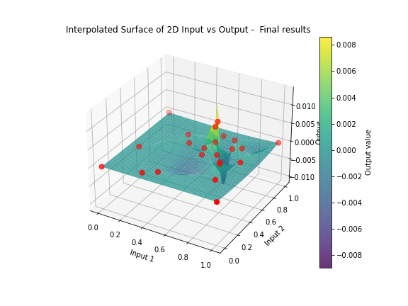
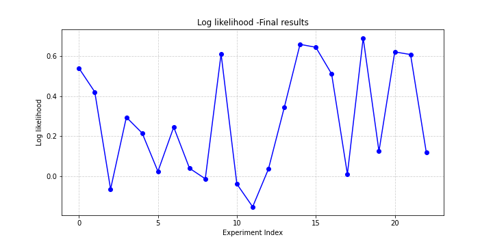
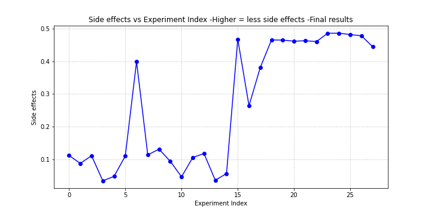
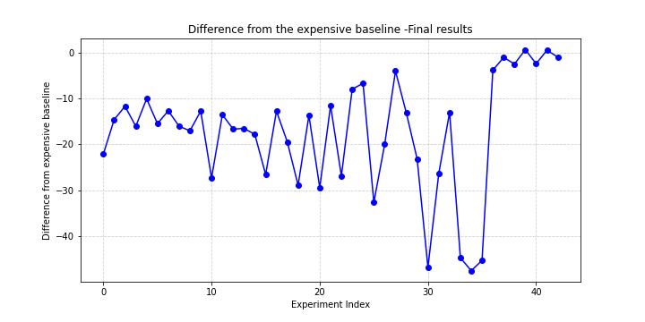
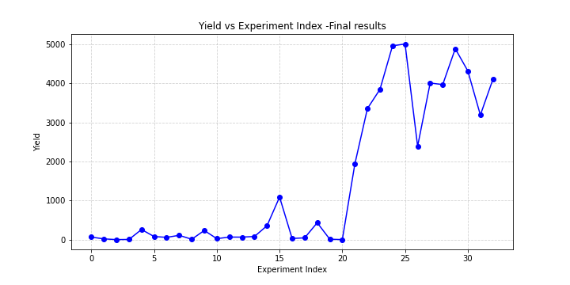
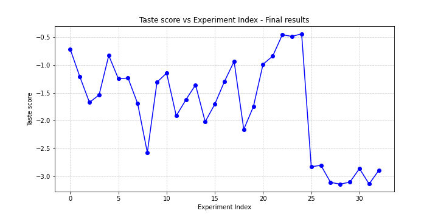
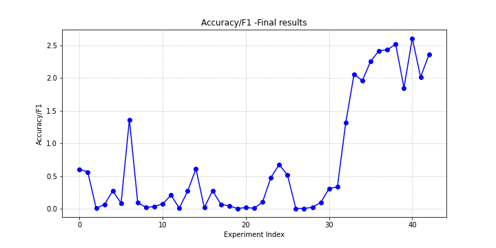
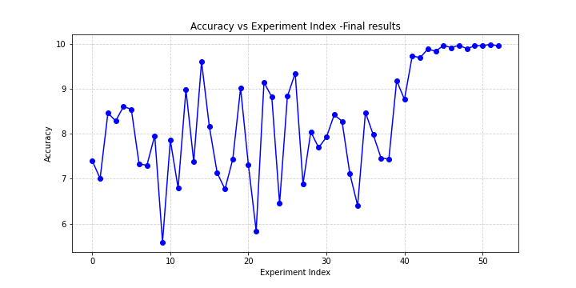

# Imperial-ML-AI-Capstone-BBO

## :gear: Imperial's professional certificate in machine learning and artificial intelligence black box optimisation capstone project. :gear: ##

## Documentation

- [Project datasheet](Datasheet)
- [Project model card](ModelCard)

## 1. Project overview
This project consists of eight black box functions of growing dimensionality that mirror real-world style ML challenges. The goal of this project is find the maximum of each unknown function using limited information reflecting a Bayesian optimisation style challenge. 

In summary: 

  - The function forms are unknown and may contain many local optima
  - Visualisations are not provided
  - Each evaluation is “expensive”, hence the need for strategies such as Bayesian optimisation
  - Only one query per function per week is allowed.

##  :rocket: 2. Data: inputs and outputs :rocket:

Each black-box function expects an input of continuous variables in a vector and will produce a single scalar value as output for review. Functions range from 2-D to 8-D representating a range of real-world scanarios such as drug discovery and radiation field exposure. Input data is expected in the format of a value beginning with 0 and six decimal places. 

e.g. 0.xxxxxx-0.xxxxxx-...

### :oil_drum: Function 1 (2D):
Detect likely contamination sources in a two-dimensional area, such as a radiation field, where only proximity yields a non-zero reading. The system uses Bayesian optimisation to tune detection parameters and reliably identify both strong and weak sources.

### :dart: Function 2 (2D): 
Imagine a black box, or a mystery ML model, that takes two numbers as input and returns a log-likelihood score. Your goal is to maximise that score, but each output is noisy, and depending on where you start, you might get stuck in a local optimum. 

### :pill: Function 3 (3D): 
You’re working on a drug discovery project, testing combinations of three compounds to create a new medicine. Your goal is to minimise side effects.

### :robot: Function 4 (4D): 
Address the challenge of optimally placing products across warehouses for a business with high online sales, where accurate calculations are costly and only feasible biweekly. To speed up decision-making, an ML model approximates these results within hours. The model has four hyperparameters to tune, and its output reflects the difference from the expensive baseline. 

### :test_tube: Function 5 (4D): 
You’re tasked with optimising a four-variable black-box function that represents the yield of a chemical process in a factory. The function is typically unimodal, with a single peak where yield is maximised. Your goal is to find the optimal combination of chemical inputs that delivers the highest possible yield, using systematic exploration and optimisation methods.

### :cake: Function 6 (5D): 
You’re optimising a cake recipe using a black-box function with five ingredient inputs, for example flour, sugar, eggs, butter and milk. Each recipe is evaluated with a combined score based on flavour, consistency, calories, waste and cost, where each factor contributes negative points as judged by an expert taster. This means the total score is negative by design. 

### :white_circle: Function 7 (6D): 
You’re tasked with optimising an ML model by tuning six hyperparameters, for example learning rate, regularisation strength or number of hidden layers. The function you’re maximising is the model’s performance score (such as accuracy or F1), but since the relationship between inputs and output isn’t known, it’s treated as a black-box function. 

### :signal_strength: Function 8 (8D): 
You’re optimising an eight-dimensional black-box function, where each of the eight input parameters affects the output, but the internal mechanics are unknown. Your objective is to find the parameter combination that maximises the function’s output, such as performance, efficiency or validation accuracy. Because the function is high-dimensional and likely complex, global optimisation is hard, so identifying strong local maxima is often a practical strategy.

## 3. Challenge objectives

Maximise all eight functions using a series of queries during black-box optimisation. There are a small number of data points to begin with making this a challenging approach. 

## 4. Model dependencies

The project and models utilised the following python packages:

- Scikit-learn 
- Numpy
- Pandas
- Scipy

## 5. Hyperparameter optimisation strategies

The optimisation strategy evolved throughout the capstone challenge in response to the new data observed each week (e.g., the posterior distribution in Bayesian optimisation).

### Phase 1 (Weeks 1-4): Exploration

-*Method:* Standard Gaussian Processes with higher kappa
-*Goal:* Create a becnhmark of baseline data, exploring the function space regions with high uncertainty
-*Insight:* Standard out of the box approaches were not performing well where the function was not smooth.

### Phase 2 (Weeks 5-10): Improved modelling of noise 

-*Method:* Remove smoothness of kernel and apply a more anisotropic kernel using multiple length scales
-*Goal:* To account for non-smoothness of some functions ensuring no false positives around local optima and to account for varying importance of dimensions in a function. 
-*Insight:* Improved optimisation in non-smooth functions and helped to avoid optimisation fixating on local optima and corners of gridspace.

### Phase 3 (Weeks 11-13): Trust regions and verification

-*Method:* Implementation of Trust Region Bayesian optimisation (TuRBO)
-*Goal:* Further improve efficiency of BO by optimising by regions where there is already data before expanding.
-*Insight:* This helped to further identify function shape particularly in high-dimnesional data and functions where there were predominant zero points.

## 6. Results

Optimisation results were variable accross the functions. In some functions, such as function 1, 7 and 8, optimisation proved relatively successful identifying a clear landscape and shape of the function with good minimisation. These functions benefited from anisotropic kernel functions, meaning understanding that each dimensions will have differential contributions to the output. For other functions, such as function 2, my optimisation was poor, with evidence that my approach was getting stuck in local optima and at the edges of feature spaces (a common issue in BO that needs to be addressed). 

These results demonstrate the importance of dynamic tuning and implementation of different approaches to black-box-optimisation dependent on previous queries. It also highlights where black box optimisation can be incredibly effective with a small number of evaluations.

*Function 1*

*Function 2*

*Function 3*

*Function 4*

*Function 5*

*Function 6*

*Function 7*

*Function 8*

## Contact details

Dr Amy Jolly
amy.jolly88@gmail.com
